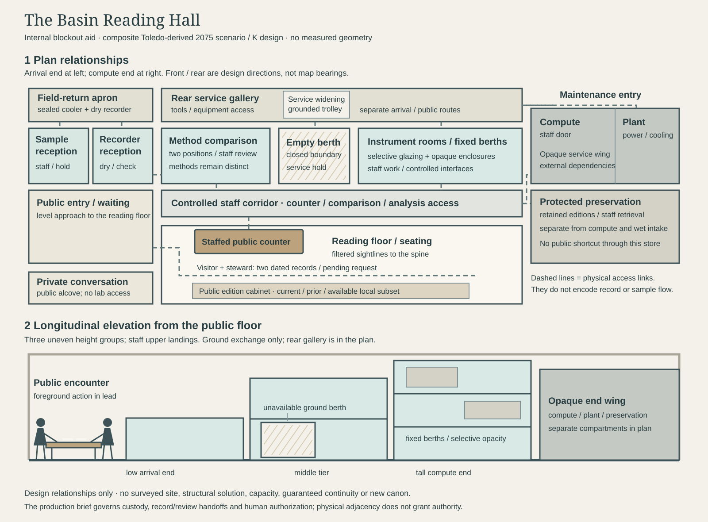

# HF-05 — The Basin Reading Hall

**Western Basin Information Ecology 2075 · visual / spatial production brief v0.1 · 3 October 2026**

**Direction selected by the user:** a civic observation and interpretation building where people inspect the basis and limits of published findings, compare methods and records, and request correction or clarification. This brief develops that direction for composition and blockout. Camera, light, geometry and device forms below are production recommendations; finished imagery has not been accepted or published. The building and its institutional arrangement remain S/K. No new C or numbered invention is established.

## Production proposition

A long civic reading floor faces a **stepped instrument spine**, rising toward an opaque compute and preservation wing. The spine has inhabited thickness: fixed room berths, removable instrument compartments, a staff corridor and a separate rear service gallery. A missing ground-level compartment exposes a bounded maintenance recess. In the foreground, a visitor and a steward compare two dated public records across an ordinary counter. The architecture makes observation, interpretation, repair and recourse visible without suggesting that access to instruments grants authority over their findings.

**Reader question:** What can I inspect, what remains uncertain, and where can I ask for a correction?

Use a composite Toledo-derived retained civic/industrial shell, conceptually connected to Maumee field and wetland work. Retained masonry piers, concrete floor repairs and a loading court provide place memory; new pale structural framing and selective translucent enclosures change the building's section. There is no surveyed parcel, named-facility retrofit, established service territory or basin-wide mandate. The hall is one possible node among other programs and laboratories.

This refines the [existing HF-05 concept](../../reports/phase17d_hero_futurescape_concepts.md#hf-05--western-basin-information-ecology-2075). Its observation wall, sample reception, bounded compute, human interpretation and repair remain. The former wet/foggy court and partly withdrawn room are replaced for this production baseline by clear diffuse daylight and a floor-supported service event. The public encounter becomes the lead action. These choices distinguish HF-05 from HF-04's tall crane hall and suspended industrial cell.

## Real-project lessons translated into form

| Project lesson and grounding | Consequence for the hall |
| --- | --- |
| The [Model Lab explorer](../../src/R/model_lab/explorer/README.md) reads saved, identified synthetic runs; it does not execute the engine or author a scenario. | Public interpretation terminals inspect selected published editions. A correction request enters a staffed review process; it does not overwrite a source record or run a hidden model. This is a proposed civic analogy, not an existing Model Lab correction feature. |
| The [v0.2A review](../../reports/model_lab_v02a_explorer_review.md) binds sources, code, configuration, units and case identity. Hash agreement checks identity/content, not scientific truth. | Give records a visible edition, date, method, scope and source trail. Detailed provenance belongs in a retrievable record drawer or terminal, rather than giant hashes across the room. |
| Model Lab traces describe qualified graph paths; unresolved routing stops some forwarding. Assumed non-forwarding is not observed ecological retention. | Comparison leaves a visible unresolved area. A blank or unavailable record slot is not filled by a neighboring instrument, a decorative flow arrow or a claim that the basin is fully observed. |
| The three saved cases are synthetic sensitivities; omission is zero only within the declared diagnostic convention. | Any Model Lab demonstration is explicitly synthetic and separate from observed public findings. Missing field observations remain missing; the hall does not translate them into zero. |
| Independent Python/R checks and frozen outputs preserve a reviewable baseline. | Keep comparison stations and retained editions distinct from the current notice face. A newer instrument or record does not silently replace an earlier basis. Independent review remains an institutional practice; two hardware boxes do not prove it. |
| [FT-10](../../reports/phase17b_lived_world_condition_packets.md#ft-10-signal-sampling-and-stewardship) distinguishes sampling, methods, privacy and authorized communication. | Receive sealed samples and recorder media through different intake lanes. Staff can hold an incomplete arrival. Public windows reveal work and limits without revealing private records. |
| [FT-11](../../reports/phase17b_lived_world_condition_packets.md#ft-11-inspection-does-not-become-authority) separates inspection from authority; [information governance](../../reports/information_governance_findings.md) separates observations, products and decision roles. | The staffed interpretation counter offers recourse. The responsible program office authorizes a revised finding, and may be elsewhere. A dock, badge or software recommendation cannot confer that authority. |
| [FT-12](../../reports/phase17b_lived_world_condition_packets.md#ft-12-the-compute-room-has-a-maintenance-door) gives compute physical dependencies and unequal replacement cycles. | Allocate opaque power/cooling service volume, access doors, spare parts and protected record storage. Local fallback is a practiced, dated subset, not guaranteed continuity. |
| The [house style](phase17d_public_visual_style_guide.md) and [visual retrospective](../../reports/phase17d_three_hero_visual_retrospective.md) require transformed section, ordinary work, functional materials and a distinct silhouette. | Build a stepped, inhabited civic edge rather than a wall of screens. Let the counter encounter, one isolated berth and an external arrival read before labels. |

The repository demonstrates software/data practices, not the engineering or public-access feasibility of this future building. Translation from those practices into rooms and devices is K design work.

## Spatial organization to carry into blockout

Use **front / rear / arrival end / compute end** as design directions, not geographic bearings. The spine runs along one long side of the retained hall. Its stepped profile grows from a low arrival-end bay through a middle tier to the tallest tier beside the compute end. Keep the opposite side of the reading floor low and open to filtered daylight.

The [SVG spatial study](../../assets/phase17d/hf05/hf05_basin_reading_hall_spatial_study.svg) is an editable internal blockout aid, not the final public system inset. Rectangles and route lengths are qualitative. The lower drawing is a longitudinal elevation from the reading floor; rear circulation is described in the plan, not falsely stacked into the elevation.

| Zone | Placement, adjacency and boundary |
| --- | --- |
| Public arrival and reading floor | Separate front entry at the low end; a level route reaches seating, record cabinets, consultation counter and private conversation alcove. Keep passage around waiting people and the counter. Public access does not require crossing sample or service handling. Detailed accessibility and egress design remain unresolved. |
| Public interpretation edge | A short counter projects into the reading floor near the low/middle spine, so two people and two records read clearly. Staff work behind it. Filtered windows show selected instrument enclosures; neither raw personal data nor unrestricted lab interiors faces the floor. |
| Controlled staff interface | A narrow staff corridor lies between the reading floor and instrument rooms. Staff doors connect consultation, method comparison and analysis. Public requests cross the counter, not an open laboratory doorway. |
| Instrument spine | Fixed frame, room berths and enclosed compartments form three uneven height groups. Enclosures have independent service access and visually separate methods. The count is a composition choice, not an inventory of local programs. |
| Rear service gallery and widening | A service-only route behind the spine joins a widened ground-level replacement bay to a maintenance court entrance. It carries tools and the grounded replacement trolley. Its removal envelope never overlaps the public route or sample reception. |
| Field return and custody threshold | At the arrival end, an outdoor covered drop-off leads to a staffed receiving vestibule. A cooler lane reaches enclosed sample reception/hold; a separate recorder lane reaches media/identity checking. Further handoffs require staff review. |
| Compute, plant and preservation wing | At the tall end, separate opaque compartments house compute, power/cooling service, and protected versioned records. Staff retrieval connects records to the interpretation edge. Exterior plant/service access joins the maintenance side; sample handling has no shortcut through this wing. |

**Three crossings to show:** the visitor's request across the public counter; the sampler's sealed handoff at receiving; the technician's isolated equipment interface at the service berth. These are different boundaries with different permissions. Color alone must not carry the distinction: use walls, doors, a counter, a hold shelf and floor edges.

**Scale rules for the artist:** establish people, seated use, a cooler trolley and door openings before enlarging equipment. A service gallery must look walkable beside its utilities. The empty berth must have a plausible floor-supported withdrawal envelope and room for a technician to work beside it. Tall tiers must show staff access landings. Use human-relative proportions rather than claimed room dimensions, clearances, structural spans or equipment capacities.

## Eight architecture and device decisions

### 1. Stepped instrument spine — keep, give it depth

Make a broken stair profile of low, middle and tall groups within an independent pale steel frame. The retained shell remains legible behind and above it. Lower rooms sit near sampling and comparison; upper compartments house selected precision/optical work in the scenario, with staff-only landings and enclosed service risers. Glazing is cloudy or patterned where it filters light or protects work; opaque panels mark environmental control, privacy and service.

The spine is a succession of rooms and interfaces, not an enormous instrument or a universal monitoring screen. Leave an interruption between groups and vary replacement panel age. Its silhouette must survive a 390 px card crop. Upper compartments are maintained in place in this baseline; whole-room extraction at height needs a separately resolved handling design and is excluded from the pictured event.

### 2. Instrument-room cassettes / empty service berth — retain the candidate, bound the exchange

Distinguish the **fixed building berth** from a **removable instrument compartment**: a compact enclosed, human-serviceable assembly with its own panel, door and mounting/interface frame. The building structure, staff landing and service gallery remain when it is removed. Whole laboratories with occupied floors do not slide out of the facade.

Place the one exchange event at ground level on the rear service widening. A removed compartment rests on a low trolley beside the berth; nobody is inside it. The recess shows a fixed backplane, separated capped power/data/environmental connections, a closed internal boundary and a visible service hold. Keep spare panels and worn seals nearby. No open sample circuit, shared exposed laboratory interior or heavy suspended load is needed.

The empty berth communicates **unavailable method / pending service**, not extra capacity. Adjacent compartments may remain available but do not automatically replace its method. Mounting, isolation, environmental control and handling feasibility remain unresolved K details. The lead shows the recess obliquely through a bounded service-side sightline; the working detail shows its interfaces clearly.

### 3. Method comparison dock — retain as a staffed comparison bay

A heavy, shallow bench sits in a controlled ground-level bay near intake and the interpretation staff corridor. Two distinct instrument/media positions share a comparison surface but retain separate adapters, cases and method records. A reference case and an older interface are visible; the newer unit is not visually crowned the winner. Small opaque storage below holds adapters and service tools.

Staff compare method/version, observation interval, units, coverage and declared uncertainty before using results together. Noncomparable results remain side by side with a hold note. Physical docking does not make them scientifically equivalent or validate a method. A selected public comparison can be carried to the counter; the raw workspace stays behind the staff boundary. Do not render assay procedures or a generic glowing calibration tunnel.

### 4. Field recorder / sample arrival interface — split the intake

Use an ordinary covered field-return apron, one vehicle or grounded handcart, a boot-worn threshold and a stainless receiving counter. A sealed cooler and its custody paperwork occupy the sample lane. A separate dry recess receives recorder cases, batteries and authorized media. Show a hold shelf for incomplete documentation or an arrival waiting for a person; reception does not imply acceptance for analysis.

Staff transfer samples toward the appropriate enclosed reception/hold space and transfer recorder records toward identity, format and provenance checks. Do not draw a single universal pipe or conveyor merging samples, data and public notices. A bounded enclosed handling link may be tested later, but robotics is unnecessary to the selected scene and must not erase the staffed handoff. No invented clinical sampling or harmful-biology workflow is specified.

### 5. Compute and preservation volume — one wing, distinct compartments

Build a substantial opaque end volume, visibly attached to service infrastructure. Give compute a staff door and a separate plant/service face with accessible filters, power conditioning and cable routes. Let cooling and power occupy recognizable depth; no capacity, efficiency, redundancy or exact utility connection is claimed.

Place preservation in a separate dry compartment with its own staff retrieval threshold. Paper/local copies, storage media and retained published editions belong here, not among hot racks or in the wet receiving room. Different replacement generations and one spare-parts shelf show ongoing work. Broad service interfaces are enough; the image should not expose credentials, network topology or a real facility's security arrangement.

### 6. Public interpretation interface — make this the scene's center

Use a staffed counter with seated and standing consultation positions, a shared two-record surface, nearby waiting seats and a small private alcove. A modest current-notice face provides finding title, publication/edition date, method/scope, known limits and the responsible office. A reader can request the supporting public record or a clarification in person, including on paper.

Keep the public face shallow and readable; behind it, staff retrieve selected records from the version store. Filtered glazing reveals that scientific work exists while protecting private work. Avoid a panoramic command dashboard, unrestricted live feeds, facial identification spectacle or an unstaffed kiosk that instantly declares truth. Detailed wording belongs in surrounding page copy, not generated raster lettering.

### 7. Continuity / versioned record storage — pair a public cabinet with a protected store

At the counter edge, use a public edition cabinet: a current notice slot, adjacent prior-edition sleeves and a request tray. The protected store holds the complete retained record and revision trail. Public drawers contain only approved public material, not all institutional holdings. Dated printed sheets and local read-only copies make edition differences physically inspectable.

A correction request has a receipt/reference and a pending state. The responsible office reviews it; an authorized revision links to and supersedes the earlier public edition without silently erasing its basis. During an interruption, staff state which dated local subset is available and which service is delayed. Copies, batteries and paper do not guarantee continuity, completeness or indefinite preservation. Format migration and retrieval checks remain recurring labor.

### 8. Maintenance access — make routes as concrete as devices

Keep the rear gallery continuous between the maintenance entrance, ground service widening and compute/plant doors. Provide staff-only upper landings and enclosed utility risers. A replacement trolley can reach the low cassette without negotiating the public counter, cooler queue or a stair. Show ordinary doors and a small barrier at the isolated berth, not theatrical security gates.

Useful depicted tasks are checking a worn enclosure seal, cleaning an optical cover, replacing a filter, inspecting capped connections, comparing an old/new adapter, or retrieving a dated local procedure. Select **one** foreground maintenance task for the detail. Identity devices, supported software and data formats also age; their work can be expressed by a record sheet and spare adapter rather than floating code. The technician prepares return-to-service checks; installation alone does not authorize findings or publication.

## The ordinary action and its consequence

A drainage worker or nearby resident brings a printed observation summary to the counter and asks whether it covers the ditch beside their field. The steward lays the current and prior public editions beside one another, checks their method and area/time coverage, and points to an unresolved portion. The visitor adds a location note to a clarification/correction request. The steward gives a receipt and routes it for review; the current edition remains identifiable while that review is pending.

The visitor need not be an expert or use a personal device. Contact/location detail stays off the wall display. The steward can explain the record but cannot promise a finding, response time or regulatory action. A responsible program office, potentially elsewhere, decides a revision within its mandate. In the background, a sampler waits at receiving and a technician works beside the isolated berth. Keep those actions secondary and spatially distinct.

This is a working civic room: chair legs scrape, a drawer opens, field cases carry mud, filtered daylight falls across two sheets, and fan sound is muted behind an opaque door. The scene's drama is a usable route for a specific question while a method is unavailable.

## Materials, light and visual hierarchy

**Recommended light baseline:** bright diffuse late-morning daylight through high north-like glazing, with a small sun patch on the reading floor. This is a lighting direction, not an asserted geographic orientation. Use a cool pale structural frame, milk-glass instrument enclosures, warm worn timber at the counter, neutral repaired concrete and muted old masonry. The court can retain mud on tires and boots without an all-wet or storm-lit scene.

Clear glass is limited to selected sightlines; patterned/translucent glass carries controlled light; opaque enamel/composite panels carry privacy and service; stainless belongs at receiving. Use different generations of seals, handles and panels. No luminous data trails, uniformly mirrored surfaces or color implying correctness, health, security or environmental benefit.

**Reading order:** two people and shared records → stepped spine and its thickness → one unavailable berth → opaque end wing → field-return glimpse. Large labels, screens and devices must not outrank the people. At card scale, the stepped edge, public encounter and one interruption cue should remain visible. Detailed provenance and permissions can wait for the working detail and system inset.

## Three lead-image composition studies

| Study | Camera and arrangement | Production judgment |
| --- | --- | --- |
| **A — Across the public counter** | Standing eye height near the front/arrival end, looking diagonally along the reading floor toward the tall compute end. Visitor and seated/standing steward occupy the lower middle; the shared sheets remain unobstructed. The stepped spine crosses the middle/background. The ground service recess is visible beyond a controlled side window/opening; field reception appears as a lateral glimpse, not a second foreground scene. Keep roughly a quarter of the frame as usable floor/daylight. | **Recommended lead.** Best expression of the selected civic purpose. Reject a crop that hides the spine or reduces the scene to an ordinary library. |
| **B — From the field-return threshold** | Eye height at the covered receiving apron. Cooler/recorder cases and sampler establish the lower foreground; separate sample and dry-media lanes lead into the low end of the spine. Through an independent public opening, show the counter encounter. The opaque wing and isolated berth sit deeper along the service side. | Strong alternate for a supporting view. Risks making the hall look like a logistics laboratory; do not select as lead if public recourse disappears. |
| **C — Along the inhabited spine** | Eye height from the far public side, across seating toward the stepped elevation. Low, middle and tall tiers form one readable silhouette; filtered windows, staff landings and the missing ground compartment expose depth. The counter pair remains a substantial near/middle-ground group; compute volume closes one end. No public upper walkway is introduced. | Strongest architectural study. Risks equal-sized room boxes and people becoming scale tokens. Use to resolve the spine, not to invent extra public circulation. |

Make these as small camera/silhouette studies before final rendering. Keep the same rooms, access boundaries and unavailable bay in all three; camera changes must not redesign the hall. A is the working recommendation, not a recorded human acceptance of an image.

## Distinct working detail and public system inset

**Working detail:** ground-level rear service gallery, independent closer composition. One technician examines a worn seal/capped backplane beside the empty berth; the removed instrument compartment rests on a trolley in the widening. Show the fixed frame, closed internal boundary, separated utility interfaces and a dated service sheet. A second instrument position or old adapter can hint at comparison, but do not crowd the task. A protected glimpse of the reading floor ties repair to civic use without creating a shared route. No crop of the lead image and no suspended room.

**System inset:** one dominant qualitative building section with a compact six-item key, adapted from the [HF-02 inset study](../../reports/phase17d_atlas_system_inset_style_study.md), not an automatic claim that its style is accepted for HF-05. Key groups:

1. Field return and separate sample / recorder reception, including hold.
2. Instrument berths and staffed method comparison.
3. Rear service route, ground replacement widening and unavailable bay.
4. Opaque compute / plant and separately protected preservation.
5. Public reading floor and staffed interpretation counter.
6. Current / retained public editions, correction request and responsible-office review.

Physical routes use plain lines and doors; any record/review arrows use a separate dashed convention. Include an explicit hold/review interruption before authorized publication. A clarification request may return for more information rather than produce a revision. Do not draw samples flowing directly into public findings. The responsible office can be outside the drawing; co-location is not jurisdiction. No quantitative flows, measured dimensions or system completeness. At narrow widths, surrounding semantic text must carry the six explanations; small SVG lettering cannot be the only explanation.

## Production handoff

Planned delivery names follow existing Phase 17D conventions. They are future targets, not files produced by this brief:

| View | Target | Intended size |
| --- | --- | --- |
| Lead image | `assets/phase17d/hf05/hf05_information_ecology_2075_hero_wide.webp` | 2400 × 1350 px |
| Working detail | `assets/phase17d/hf05/hf05_information_ecology_2075_maintenance.webp` | 1600 × 1200 px |
| System inset | `assets/phase17d/hf05/hf05_basin_reading_hall_section.svg` | 1440 × 900 viewBox; display coordinates only |

Retain editable/native source or documented illustration settings, exact prompt/reference lineage and packaging notes. Optimize final WebPs and keep one delivery per view; start with the established approximate budgets of 1 MiB lead, 600 KiB detail and 50 KiB inset, allowing justified legibility exceptions. The internal spatial-study SVG is a source aid, separate from those three targets.

**Lead production prompt:**

> Illustrate a composite Toledo-derived civic observation and interpretation hall in 2075, viewed at standing eye height diagonally across a staffed public counter. A visitor and steward compare two dated paper records and prepare a clarification request; their hands, shared surface and ordinary waiting/seating route are clear. Behind them, a substantial stepped instrument spine rises in three uneven groups toward an opaque compute and preservation end wing inside a retained masonry/concrete shell. Selective milky glazing, opaque service panels, pale structural framing, staff-only landings and separate service depth make the spine inhabitable. One ground-level instrument berth is unavailable, with a closed internal boundary and a bounded service recess glimpsed obliquely; a removed compact compartment rests on a trolley on the rear service side. A lateral covered field-return interface shows a sampler waiting with a sealed cooler and a separate recorder case. Bright diffuse late-morning light, limited sun patches, worn timber counter, repaired concrete, aged masonry and differing panel generations. Lead with the public encounter, then the stepped architecture; keep services and arrivals secondary. Preserve distinct public, staff, custody and maintenance routes. No large display text, glowing data streams, suspended room, command center, universal truth machine, seamless automation, private records, measured performance or named real facility.

**Proposed public title:** Western Basin Information Ecology 2075. **Place name within the page:** The Basin Reading Hall. **Caption:** “Composite Toledo-derived 2075 scenario and design concept.” Repository notation remains “S/K; K architectural form; no new C,” following the [public language guide](../public_atlas_language_guide.md).

**Draft lead alt text:** “A visitor and steward compare public records at a counter facing a stepped instrument spine, with an isolated service berth and an opaque compute wing behind.”

**Draft detail alt text:** “A technician checks a worn seal beside an empty ground-level instrument berth; the removed compartment rests on a trolley in a separate service gallery.”

**Draft inset description:** “Qualitative hall section separating field reception, method comparison, service access, compute and preservation, public interpretation, and review of a correction request.” Final alt text must match the actual selected images.

## Grounded, conditional and unresolved

**E grounding:** accepted observation/information-governance and technology dependencies, with their existing uncertainty. **Real-project practice:** saved synthetic Model Lab products, source/version checks, independent validation and frozen baselines; these are practices, not new environmental observations. **S:** continued staffed sampling, stewardship, privacy, maintenance and authorized communication under conditional future arrangements. **K:** this building, its name, co-location, stepped geometry, cassettes, docks, cabinets, workers and particular public-review procedure. The FT-11/12 working sketches remain K. None becomes C through illustration.

Unresolved engineering includes structure, compartment environmental controls, isolation, fire/egress/accessibility provisions, equipment exchange, plant sizing and preservation conditions. Unresolved institutional choices include ownership, staffing, public-record access rules, mandates, correction rights/process and service coverage. Do not invent a named regional institution, capacity, construction date, response guarantee, redundant network or continuous observation capability.

Model Lab is a grounding example of accountable interpretation. It does not establish empirical loads, concentrations, travel time, nutrient removal, health outcomes or calibrated performance. A beautiful interface cannot supply missing evidence. The base scene needs no quantum-derived device; any later application-specific sensing variant remains a separate K comparison study against established methods.

## Recurring invention candidates

| Candidate | What this brief tests | Later reuse test |
| --- | --- | --- |
| Environmental instrument-room cassette | Existing catalog candidate refined to a removable compartment within a fixed berth; unavailable method, interface depth and a grounded service event are visible. | Reuse in another observation setting with a different method and service constraint. Demonstrate that the same interface grammar changes space rather than decorating it. |
| Civic observation / interpretation wall | Existing candidate becomes a staffed counter, selected notice face, protected work behind and a concrete correction route. | Reuse in a small field office or civic threshold while keeping public material, private records and authorization distinct. |
| Method comparison dock | New unnumbered K candidate: separate methods meet at a staffed comparison surface without becoming equivalent. | Test incompatible adapters, intervals or units in a different program; preserve a noncomparable/hold outcome. |
| Versioned public edition cabinet | New unnumbered K candidate: current and earlier public editions plus dated fallback and request receipt. | Test a delayed release or interrupted retrieval elsewhere; show the available subset and the unresolved request. |

All four remain provisional. The [invention catalog](phase17d_glass_basin_invention_catalog.md) retains GBI-01 through GBI-03; this brief assigns no new number and records no cross-scene or visual acceptance.

## Review tests before finished-image production

- The spine changes room depth, access and maintenance, and reads as a stepped civic edge at 390 px.
- The two-person record encounter survives the lead crop; public recourse is an action, not a tiny label.
- Public circulation, field reception, staff work and equipment removal remain distinct and continuous in every view.
- A floor-supported service event has space for a technician and trolley; upper units do not imply an unresolved extraction mechanism.
- Compute has opaque plant/service volume; preservation is separately protected; no route sends wet intake through the records store.
- The missing compartment has a closed boundary and an unavailable-method consequence. Adjacent instruments do not imply automatic coverage.
- Current, prior and pending records are distinguishable in the detail/inset; public requests cannot directly edit findings.
- Sample custody, method comparison, interpretation and responsible-office authorization have a visible hold/review boundary.
- Materials, light, ordinary work and silhouette distinguish this civic hall from HF-04's suspended industrial replacement.
- Captions, alt text and surrounding copy preserve composite place, synthetic-model limits, S/K status and unresolved engineering/governance.

Next production action: create the three camera/silhouette studies from this shared blockout and review the recommended A composition. No final raster production, public route integration or publication is recorded by this brief.
